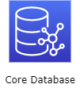
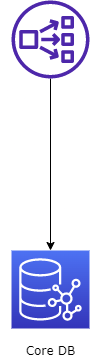

# IYAGI Backend Architecture I

## IYAGI 프로젝트의 탄생 배경

**IYAGI**는 음성 기반 소셜 네트워크 서비스이다. 이 프로젝트의 구상은 2020년 7월엔가 했던 것 같고 GitHub에 공식적으로 저장소를 열게 된 건 정확히 2020년 8월이다. 비슷한 캐치프레이즈를 들고 나온 Club House 출시일보다 훨씬 일렀으니 클럽 하우스를 보고 영감을 얻은 프로젝트는 아니다.  

### 서비스를 만들려면 알아야 한다

우리는 성공하고 싶었다. 소설을 번갈아 가며 사람들끼리 모여 이어쓰는 일종의 문학 소셜 서비스를 만들려고 했다. 누군가가 아이디어를 줬기 때문이다. 초기 아이디어만 듣고 그럴싸해보여서 시작은 했지만 구현 단계에 들어가서 진행할수록 뭔가 고려하지 못한 부분이 굉장히 많다는 걸 알게 됐다. 그러다 아이디어 제공자는 말 그대로 초기 아이디어만 있었을 뿐 수익 구조나 여러가지 발생가능한 문제에 대해서는 전혀 생각하지 못했고 우리 또한 마찬가지였다.  
당시 나는 건강을 위해 맨몸운동을 하고 있었는데 내가 당시 필요했던 루틴을 알아서 돌려주고 타이머도 해주는 앱이 전무해서 그걸 직접 만들어서 운동하려고 했다. 혼자서 개발하다가 문학 소셜 앱 프로젝트가 엎어지자 회의 때 살짝 이야기를 꺼내보았다. 요지는 지금까지 우리가 프로젝트를 엎기만 했으니까 우리가 잘 아는 이 운동앱을 가지고 토이 프로젝트를 완성시켜 보자. 출시까지 해보자! 했던 것이었다. 우리 UX 디자이너도 헬창이었기 때문에 운동앱을 만들면서 고려해야 할 부분들이 뭔지에 대해 세심하게 잘 알고 있었다.  
이 토이 프로젝트를 진행하면서 우리가 깨달은 점은 개발자가 그 필요성에 대해 느끼고 공감할 수 있는 서비스를 만들어야 한다는 것이다. 그렇지 않은 서비스는 결국 필요한 기능은 넣지 못하고 필요 없는 기능은 덕지덕지 붙어 철학도 비전도 없는 잡서비스가 되어버리고 만다. 그래서 우리는 초기 구상부터 다시 시작했다, 완전 초기부터.

### 우리의 목표를 알자!: 돈

우리는 매우 솔직해지기로 했다. 우리가 앱을 왜 만드나? 공익에 기여하기 위해? 세상의 평화를 위해? 아니다. 돈이다. 우리는 돈을 많이 벌고 싶었다. 그래서 아주 단순하게 구글 플레이 스토어에 들어가(애플 앱스토어는 매출별 앱 순위를 제공하지 않는 것 같았다.) 앱 매출별 순위를 찾아봤다. 물론 이 매출별 순위라는 것은 인앱 결제를 기준으로 하기 때문에 앱 자체가 아니라 간접적인 방식으로 돈을 버는, 예를 들자면 플랫폼 서비스 앱의 매출은 전혀 잡히지 않는다. 사실 당시에는 플랫폼 기업들이 세계를 지배하고 있다는 것은 알고 있었으나 우리가 당장에 아무것도 없이 플랫폼을 구축할 수는 없다고 판단했기에 매출별 앱 순위를 보기로 했다.  
나는 뭐랄까... 어떤 혁신적인 앱들이 순위권을 차지하고 있을까? 하고 봤더니 사실 대부분이 데이팅앱이거나 유사 데이팅앱들이었다. 하아.. 이럴 수가... 성욕에 미친 인간들....이라고 하기에는 사실 3대 욕구 중에 우선 순위가 조금 밀려서 그렇지 수면욕과 식욕이 생물학적으로는 얼마든지 충족되는 현대 사회에서 1순위 욕구라고 볼 수도 있을 것 같다. 그래서 사실 우리는 데이팅앱의 요소를 가미한 보이스톡 서비스를 만들기로 했던 것이다. 약간 Azar의 음성 버전이라고나 할까? 사람들의 본능적인 욕구를 자극해야 돈을 벌 수 있다는 마음이었다. 그러나 플레이 스토어에 널려있는 각종, 거의 방치 상태인 보이스톡 앱들과 그 과금 체계, 그리고 욕구를 자극해서 과금하게 하는 시스템을 따라하기에는 너무 차별점이 없어서 이런 저런 기능들을 기획하다 보니 새로운 게 보였다.  

### 음성 기반의 소셜 네트워크 서비스

이렇게 많은 기능들을 넣을 거면 사람들의 본능적이고 충동적인 과금에 의존하지 않아도 되지 않을까? 최근 NC의 주가 폭락, 그리고 다른 비슷한 데이팅스러운 앱들을 보면 매출이 좋기는 한데 일정 규모 이상 커지지를 못한다. 대부분 그렇다. 소위 말하는 양지에서 놀지를 못한다고 해야 하나? 그래서 우리는 다시 생각해봤다. 이 프로젝트를 끌고 가도 되나? 그런데 가만히 생각해보니 음성 기반의 소셜 네트워크 서비스가 아직 없다는 점을 깨달았다. 분명히 그럴만한 이유가 있었으리라 생각하지만 영상도 대박이고(유튜브), 사진도 대박이고(인스타그램), 텍스트도 대박인데(트위터), 음성은 그러지 말란 법이 없지 않은가? 각 플랫폼들은 해당 미디어를 공유하는 핵심 기능을 편하게 쓸 수 있도록 구현해두었다. 우리도 음성 공유의 본질을 잘 살펴 서비스를 구현한다면 괜찮은 게임이 되리라 기대했다. 이제 **IYAGI** 프로젝트는 단순한 보이스톡 앱을 넘어선 음성 기반 소셜 네트워크 서비스로 거듭난 것이다.

## Architecture에 대한 고민

프론트엔드의 아키텍처는 Clean Architecture라고 하는 검증된 아키텍처가 있고 상태 관리 메서드도 Flutter에서는 Bloc Architecutre를 쓰면 대부분의 규모의 프로젝트를 커버할 수 있다. 그런데 백엔드는 좀 다르다. 블로그를 만든다거나, 쇼핑몰을 만든다고 한다면 그에 걸맞은 아키텍처 예제가 인터넷에 차고 넘친다. 그런데 소셜 네트워크 서비스, 더 나아가 하나의 플랫폼을 구성하려면 이게 만만치가 않다. 왜냐하면 '일반적인' 플랫폼이라는 것은 있을 수가 없기 때문이다. 플랫폼은 하나의 경기장이다. 플랫폼은 규칙을 만들고 관리하며, 플랫폼 위의 주체들의 상호작용을 중개하고 관리해야 한다. 특히 이 모든 상호작용 형식이나 스키마가 모여서 '규칙'을 만들고 그 규칙들이 이 플랫폼의 정체성을 말하기 때문에 일반적인 아키텍처 예제가 있기 힘든 것이다. 그래도 페이스북, 인스타그램의 아키텍처에 관한 포스팅과 아티클들을 보며 고민을 약 한 달 간 했던 것 같다. 이제 우리 서비스의 아키텍처 구상을 블로그에 조금씩 정리해보면서 완성해 나갈까 한다. 혼자 골머리 앓으며 생각하는 것보다 글을 적어내려 가는 것이 생각 정리에 훨씬 좋다는 것을 느끼기 때문이다.

### Core Data Repository

코어 데이터베이스에 대한 고민이다. Client 단에서부터 들어가는 방식으로 할까 아니면 백엔드 가장 중심부부터 뻗어나가면서 할까 고민하다가 Client 단에서의 흐름은 한 가지 방향으로 가는 게 아니기 때문에 가장 중심부, 즉 메인 데이터베이스에 대한 고민부터 해보려 한다.  

페이스북과 인스타그램 같은 경우 가장 바닥에는 MySQL을 메인 DB로 쓴다고 한다. 이해할만하다. RDB는 신뢰도와 일관성이 높기 때문에 데이터의 최종적인 저장소로 알맞아 보인다. 그러나 문제는 읽기 쿼리가 빈번한 SNS 서비스에서 방대한 양의 쿼리를 빠른 시간 내에 처리할 수 없다는 점과 소셜 네트워크를 RDB로 구현하게 되면 관계 테이블이 심각하게 복잡해지고 자기 참조 문제를 해결하기도 힘들며 JOIN 연산이 많이 쌓이게 되면 쿼리 시간이 기하급수적으로 늘어난다는 문제가 있다. 이 점을 페이스북에서는 in-memory 그래프 데이터베이스 캐시로 해결하고 있고 인스타그램은 전통적인 방법, 즉 key-value 형태의 in-memory 캐시를 사용하여 쿼리 퍼포먼스를 보장한다. 페이스북 같은 경우는 현재 인스타가 쓰는 방식을 쓰다가 key-value 방식의 캐시를 사용했을 때 자원 낭비가 극심해서 캐시 데이터베이스를 그래프로 바꾼 것이다. 그 이유는 key-value DB를 캐시로 쓰면 보통 key가 쿼리문 그 자체이다. 그런데 RDB에 일반적인 relation을 구현해 놓은 게 아니라 유사 그래프 데이터베이스처럼 데이터 스키마를 꾸려놓아서 캐싱하기 편하도록 했다고 한다. 그런데 쿼리가 이미 캐싱된 노드와 경로가 연결된 쿼리라고 하더라도 쿼리문 자체가 다르면 중복된 데이터를 또 불러와서 캐싱하기 때문에 비효율적이라는 것이다. 그렇다면 아예 메인 DB를 그래프 데이터베이스로 하면 되지 않을까?  

메인 DB를 그래프로 선정했을 때 얻을 수 있는 이점은 다음과 같다.

* 쿼리 퍼포먼스가 크게 증대된다.
* 소셜 네트워크 구조를 자연스럽게 만들 수 있다.

단점은 딱히 모르겠다. RDB와 비교해서 보일 수 있는 단점을 다음과 같이 나열할 수 있는데

* 임의 탐색을 하는 쿼리는 시간이 엄청 오래 걸린다.
* Reliability와 Consistency 문제가 있을 수 있다.

사실 첫 번째 문제는 거의 일어날 수가 없는 것이, SNS에서 발생하는 대부분의(내 생각에는 모든) 쿼리는 노드를 알고 있기 때문이다. 임의 탐색이라고 한다면 사용자의 id를 검색하거나, 태그를 검색하는 경우인 것 같은데 이것은 Elastic Search를 사용하면 해당 탐색들의 시간을 매우 단축할 수 있다. 두 번째 문제는 사실 RDB와 그래프 데이터베이스를 1대1로 비교했을 때의 문제지 이게 수평적 확장이 이루어지는 백엔드에서라면 사실 큰 차이가 나지 않는다고 생각한다. 왜냐하면 어차피 RDB도 수평적 확장이 이루어졌을 때는 Eventual Consistency를 달성할 수밖에 없기 때문에 큰 상관이 없어 보이고 Reliability는 AWS의 그래프 데이터베이스 서비스인 Neptune은 완전관리형 데이터베이스여서 내가 딱히 신경 쓸 부분이 없다. 그래서 메인 DB는 AWS의 Neptune을 사용할 것이다!! 이제 우리 아키텍처 다이어그램에 AWS Neptune이 놓여졌다!

지금은 완전히 구체적인 수준은 아니고, 어느 정도 추상적인 수준에서의 구상이기 때문에 각종 밸런서라든지, Availability Zone에 관한 문제, 보안 문제 등에 대해서는 다이어그램에 포함시키지 않을 예정이다.  
어쨌든, Neptune은 외부에서 직접 접근할 수 없으므로 NLB를 통해 접근할 생각이다. 그렇게 되면 다음과 같다.  

캐싱 같은 경우에는 Elastic Cache를 쓰는 것보다, Neptune에서 직접 지원하는 캐싱 서비스를 사용하기로 했다. 왜냐하면 Elastic Cache는 key-value 기반의 캐싱밖에 지원하지 않는데 이렇게 되면 페이스북이 맞닥뜨린 문제를 그대로 마주하게 된다. 그래프 형태의 데이터를 어떻게 key-value 형식에 효율적으로 끼워맞춰야 할지에 대해 고민해야 한다는 것이다. 그러나 Neptune 자체에서 지원하는 캐싱을 사용하면 그 부분에 대해서 고민하지 않아도 된다. 그러나 캐싱 설명서를 보면 똑같이 key-value 형식인 것 같기는 하다. 그래도 따로 구현하지 않아도 된다는 점에서 점수를 준다.  

## 마무으리

오늘은 여기까지! 계속해서 아키텍처 구상은 이어진다. 꽤 고단한 작업이다. 차라리 코딩이 편하다.
