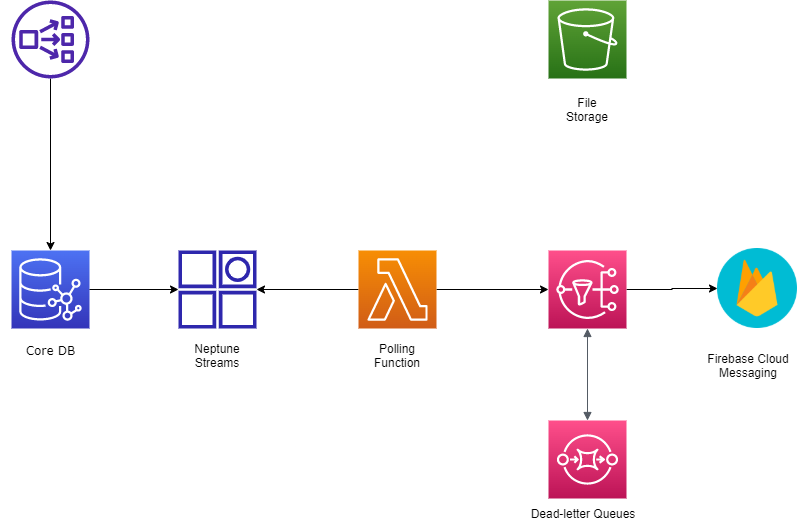
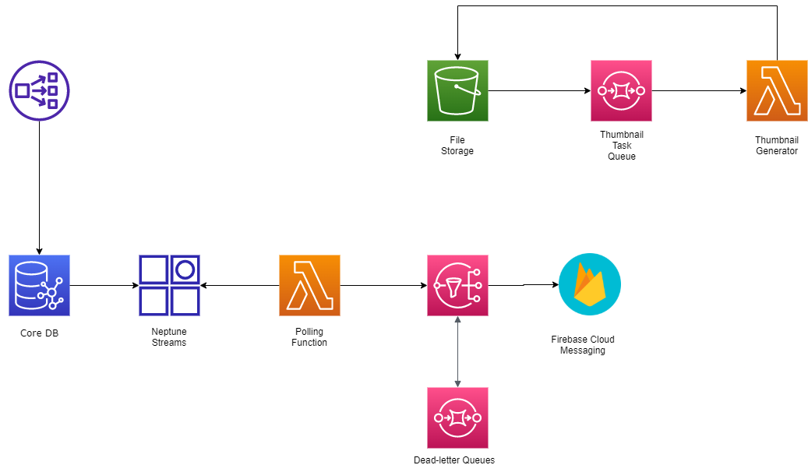

# IYAGI Backend Architecture II

[지난 이야기 (IYAGI Backend Architecture I)](2021-11-14-iyagi-backend-arch2.md)

### 푸시 알림 기능

뭔가 클라이언트의 입장에서 생각해봤을 때 코어 DB에 뭔가 수정되거나 새로운 데이터가 생겼을 때 그게 나와 관련된 이벤트라면, 내가 구독하고 있는 이벤트라면 당연히 알림을 받고 싶을 것이다. 그러면 DB에 새로운 노드와 엣지가 추가될 때마다 알려줘야 할 텐데 검색해보니 이걸 CDC라고 하더라. CDC는 Capturing Data Change의 두문자인데 AWS Neptune에서는 Neptune Streams라는 이름으로 기능을 제공하고 있었다. 나는 [이 문서](https://aws.amazon.com/ko/blogs/database/capture-graph-changes-using-neptune-streams/)를 참고했다. 문서에서 제공하고 있는 CloudFormation Template은 직접 Stack을 생성해서 보려고 했는데 모종의 이유로 중간에 생성이 실패해서 핵심적인 Lambda 코드를 살펴보지는 못했다. 그러나 핵심 컨셉은 Neptune Streams 자체가 Event를 Publish 하지는 않기 때문에 interval을 정해두고 서버리스 함수를 계속 호출해서 데이터를 받아오는 Polling Framework를 만들어야 한다. 지금까지 그린 구조를 그림으로 나타내면 다음과 같다.

이 Lambda 서버리스 함수는 일정 시간마다 Trigger되어서 Neptune Streams에 있는 새로운 로그를 불러와 푸시 알림이 필요한 데이터 변경사항이 있다면 푸시 알림을 해줘야 한다. 이 푸시 알림을 하기 위해서는 Firebase Cloud Messaging(FCM)을 사용해야 하는데 AWS Service와 FCM을 연결해줄 징검다리가 바로 Simple Notification Service(SNS)이다. [이 문서](https://aws.amazon.com/ko/premiumsupport/knowledge-center/create-android-push-messaging-sns/)를 보면 SNS 콘솔에서 플랫폼 애플리케이션을 생성해서 FCM API를 사용할 수 있다. 그리고 행여나 메세지가 오류로 전달되지 않을 경우를 대비해 FIFO SQS를 Dead-letter queues 저장소로 붙여준다. 이렇게 해서 푸시 알림 기능까지 만들면 다이어그램은 다음과 같이 나온다. Yay!

### 파일 저장

여느 소셜 네트워크 서비스와 마찬가지로, 사실 어떤 서비스들과 마찬가지로 우리 서비스도 여러가지 파일을 저장해야 한다. 작게는 유저의 프로필 사진부터, 우리 서비스의 상징, 오디오! 오디오 파일을 저장해야 한다. 저장하는 것뿐 아니라 전 세계의 유저들에게 배포 또한 신속하게 되어야 한다. 그리고 오디오 파일 같은 경우에는 우리 앱의 핵심 파일이기 때문에 이와 관련해서 분석도 필요할 것이고, 후처리가 필요할 수도 있을 것 같다. 일단 AWS의 파일 저장소인 S3를 다이어그램에 추가해본다.

사진 같은 경우에는 사진 원본이 쓰이는 경우는 잘 없고 보통 썸네일의 형태로 소비되기 때문에 프로필 사진이나 포스트의 사진 prefix에 새로운 사진이 올라오면 lambda 함수를 이용해 썸네일을 생성해주도록 할 것이다. 썸네일 생성이 실패할 경우에 다시 작업 대기열에 넣어서 다시 시도할 수 있도록 해야 하기 때문에 SQS를 사용하여 작업 대기열을 만들고 대기열에 메세지가 들어오면(S3 버킷에 파일이 생성되면) Lambda 함수를 트리거 하도록 할 것이다.

생각을 해보니 파일은 파일로만 존재하는 것이 아니라 그 메타 데이터도 보관할 필요성이 있어 보인다. SQS에서는 메세지는 한 번에 한 Consumer만 받아갈 수 있다. 그래서 한 번 Lambda 함수가 메세지를 소비해버리면 메타 데이터 DB는 메세지를 받아볼 수 없다. 메세지가 Polling 된다고 해서 언제나 사라지는 것은 아니지만 Lambda 함수는 SQS Trigger로 메세지를 받고 성공적으로 함수 실행이 완료되면 메세지를 삭제한다고 한다. 그러면 상당히 난감해지기 때문에 SNS와 SQS를 결합하여 Fan-out 패턴을 구현하고 메타 데이터 DB로 빠른 완전관리형 NoSQL DB인 DynamoDB를 사용할 것이다.  

DynamoDB에 대한 쓰기 작업은 언제나 내부에서 이루어질 테지만 외부에서 클라이언트가 메타 데이터를 읽을 수가 있어야 한다. DynamoDB에 대한 접근은 SDK에서 가능한데 지금 Flutter 공식 SDK가 없기 때문에 API Gateway와 Lambda 함수를 이용해 DynamoDB에 읽기 접근할 수 있는 REST API를 배포할 것이다.

## 마무리

푸쉬 알림에 대해서는 어느 정도 완성이 된 것 같고 파일 저장은 파일을 저장하고 약간의 처리를 하는 것까지는 된 것 같지만 오디오 파일에 대한 후처리 부분도 필요할 것 같다.

다음으로 생각할 것이라면, Full-text search를 위한 Open Search 서비스를 Neptune에 통합시키는 것이 필요할 것 같다. 또 Cognito를 이용한 유저 풀 관리 및 유저 인증 관리 또한 필요해 보인다. 역시 작은 프로젝트가 아니었던 것 같다. 중요한 구성 요소들에 대해 빠짐이 없도록 노력, 또 노력해야 한다.