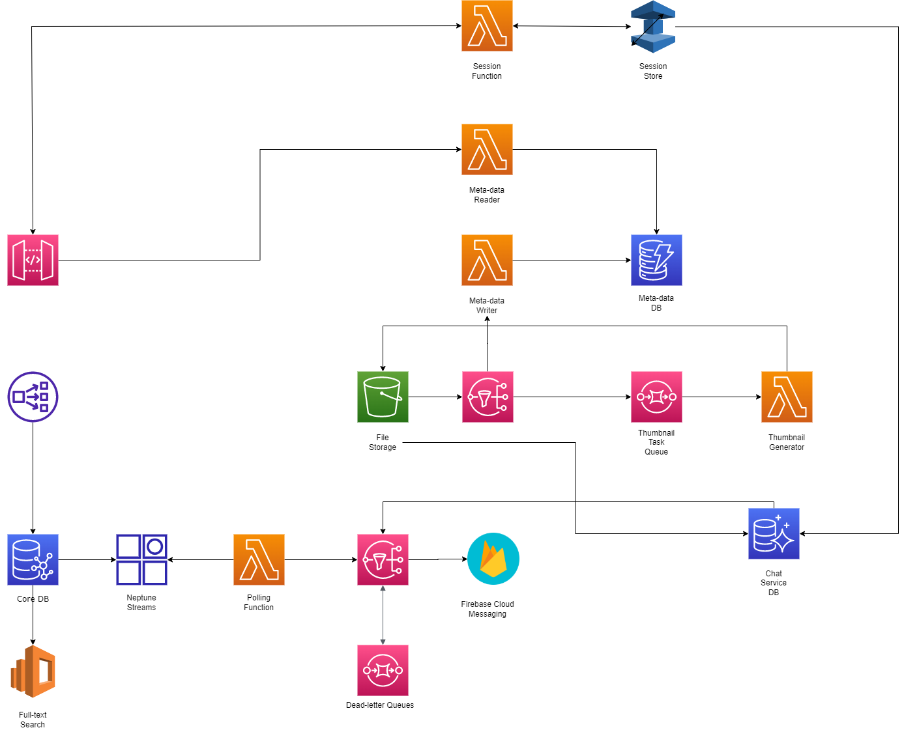
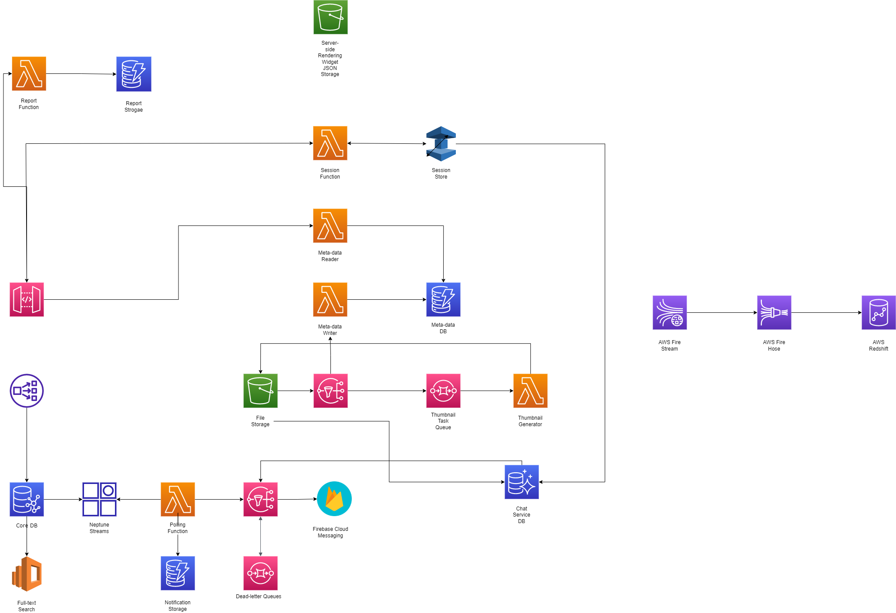

# IYAGI Backend Architecture III

[지난 이야기(IYAGI Backend Architecture II)](https://tksuns12.github.io/project/iyagi-backend-arch4/)

## 중간 정리

지난 이야기에서 논의했던 부분들을 다이어그램으로 그리지 않았다. 다이어그램으로 나타낸 지금까지의 아키텍처 구상이다.

채팅 서버에서는 기존의 포스트와 그에 첨부된 사진 자체는 아니더라도 썸네일까지는 접근할 수 있어야 하기에 연결된 곳이 많다.

## SSR(서버 사이드 렌더링) 및 CI/CD 구성

서버 사이드 렌더링에 관해 생각해야 한다. 왜냐하면, 상품 결제 페이지는 빈번한 변경이 이루어질 텐데 유저가 수시로 앱스토어에서 앱을 최신 버전으로 유지할 수가 없기 때문에 더 이상 판매하지 않거나 가격이 변경된 상품을 유저가 구매 시도하는 대참사가 발생할 수 있다.  
이럴 때 쓸 수 있는 방법이 코드 푸시라는 게 있다고는 들었는데, 공식적으로는 리액트 네이티브에서만 가능하고 Chimera라는 서비스가 플러터에 있기는 한데 아직 만들어진지 얼마 되지 않는 서비스라 프로덕션 레벨에 쓸 수는 없을 것 같아 서버 사이드 렌더링으로 다이내믹 렌더링을 해보려고 한다.  
사실 플러터에서 내가 하고자 하는 SSR은 거창한 것은 아니고 화면에 그릴 위젯들을 JSON 형태로 서버에 올려두고 클라이언트 단에서는 [json_dynamic_widget](https://pub.dev/packages/json_dynamic_widget)이라는 패키지를 사용해 JSON을 파싱해서 그에 따라 위젯을 그려주도록 할 것이다. 그를 위해 간단한 S3 Bucket을 하나 마련해주면 될 듯 하다.  
그 다음 고민할 것은 CI/CD인데 예전에 Github로 하는 걸 봤는데 조금 복잡하고 직관적이지 않은 반면에 CodeMagic을 사용하면 쉽게 CI/CD를 구현할 수 있을 것 같다.  

## 결제 플로우

결제 플로우에 대해 깊은 고민을 해야 할 수도 있겠다 싶었는데 일단 지금은 우리 앱의 주요 판매 상품들이 구독권과 앱 내 재화에 관한 거라 어쩔 수 없이 Google Pay와 Apple Pay밖에 사용할 수 없으므로 따로 백엔드에 해당하는 플로우를 지금 구성할 필요는 없을 것 같았다. 그냥 [해당 패키지](https://pub.dev/packages/pay)를 사용해 클라이언트 단에서 결제 기능을 구현하는 것으로 충분할 것 같다.

## 신고 DB, 알림 DB, 그리고 분석 플로우

신고 DB와 알림 DB 모두 Dynamo DB로 구성할 것이다. 다만 둘이 다른 점은 알림 DB는 푸시가 이루어질 때 작성되고, 신고 DB는 클라이언트 단에서 API를 직접호출해서 작성해야 한다는 점이다. 그래서 신고 DB는 API Gateway에 직접 물려주고, 알림 DB는 메인 DB 업데이트를 Polling하는 서버리스 함수에 물려주면 될 것 같다. 그리고 로그 분석은 AWS Fire 시리즈와 Redshift를 사용하여 저장하고, 분석하면 될 것 같다. 이것을 다이어그램에 추가하면 다음과 같아진다.

## 어설픈 마무리

중간에 이런 저런 처리할 일들도 생기고 이제 창업이 임박하니 내가 하게 될 줄은 전혀 몰랐던 일들, 신경 써야 할 부분들에 집중하다 보니 시리즈가 길어진 것 같다. 일단 이 정도로 간결하게 마무리하는 게 좋을 것 같다. 당분간은 Backendless를 사용하고 AWS 경험자를 채용해 이 아키텍처를 기반으로 해서 세부 설정은 맡겨서 진행하려고 한다. 혼자서 할 수도 있겠지만 대략적인 구조를 짜는 것과 실질적으로 구현하면서 살펴야 하는 것들, 특히 보안 문제를 신경쓰다 보면 시간이 많이 걸릴 게 자명해 보인다.  
이제부터는 다시 앱 작성에 본격적으로 돌입하려고 한다. 원래는 비효율적인 우리 앱의 백엔드 구조에 대해서 충격을 먹고 코딩을 중단하고 AWS로 아키텍처를 짜보려고 했던 것인데 시간이 더 들 수 있다는 점 때문에 다시 Backendless로 돌아가려 한다. 구조의 비효율성은 미친 듯한 in-memory cache로 당분간 때우려 한다. 페이스북도 초창기에는 그렇게 했으니 우리도 어느 정도 동접자 수를 달성할 때까지는 충분히 버틸 수 있을 것 같다. 우리 이야기 화이팅이다!!
